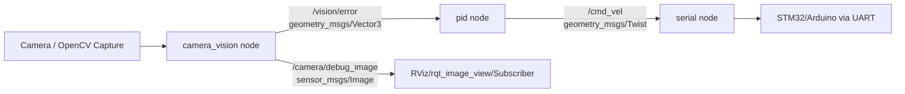

# Pan Tilt Controller (ROS 2)

Dokumentasi ini merangkum struktur sistem `pan_tilt_controller` secara ringkas dan siap dipakai untuk halaman GitHub repository.

## 1) Deskripsi Sistem

Sistem ini adalah pipeline kontrol pan-tilt berbasis ROS 2 untuk melakukan tracking objek berwarna hijau dari kamera lalu menggerakkan aktuator pan/tilt melalui serial.

Alur utama:
1. Node visi membaca frame kamera dan menghitung error posisi target terhadap pusat frame.
2. Node PID mengubah error posisi menjadi perintah kecepatan pan/tilt.
3. Node serial mengirim perintah tersebut ke mikrokontroler (mis. STM32/Arduino) via UART.

Tujuan kontrol: menjaga target tetap dekat titik tengah frame kamera.

## 2) Arsitektur Node

Node yang dijalankan dari launch file `launch/pan_tilt.launch.py`:

| Node Name (runtime) | Executable | Peran |
|---|---|---|
| `/camera_vision` | `camera_vision_node` | Deteksi objek hijau, hitung error X/Y, publish debug image |
| `/pid` | `pid_node` | Hitung kontrol PID dari error visi menjadi `cmd_vel` |
| `/serial` | `serial_node` | Kirim `cmd_vel` ke perangkat melalui serial |

Catatan:
- Nama runtime di atas berasal dari `name=` pada launch file.
- Nama internal class/node pada source adalah `camera_vision_node`, `pid_node`, `serial_node`.

## 3) Parameter List

### 3.1 `/camera_vision`

| Parameter | Tipe | Default (kode) | Default (launch) | Keterangan |
|---|---|---|---|---|
| `camera_id` | integer | `0` | `0` | Index kamera OpenCV |
| `frame_width` | integer | `640` | `640` | Lebar frame |
| `frame_height` | integer | `480` | `480` | Tinggi frame |
| `deadzone` | integer | `40` | `0` | Ambang error agar dianggap nol |
| `show_debug` | boolean | `false` | `true` | Tampilkan window debug + overlay |
| `flip_horizontal` | boolean | `true` | tidak di-set | Mirror frame horizontal |

### 3.2 `/pid`

| Parameter | Tipe | Default (kode) | Default (launch) | Keterangan |
|---|---|---|---|---|
| `Kp` | float | `0.5` | `3.0` | Gain proporsional |
| `Ki` | float | `0.01` | `0.0` | Gain integral |
| `Kd` | float | `0.1` | `0.0` | Gain derivatif |
| `max_vel` | integer/float | `2000` | `5000` | Batas saturasi output |
| `rate_limit` | integer/float | `200` | `1000` | Batas perubahan output per callback |

### 3.3 `/serial`

| Parameter | Tipe | Default (kode) | Default (launch) | Keterangan |
|---|---|---|---|---|
| `port` | string | `/dev/ttyACM0` | `/dev/ttyACM0` | Port serial perangkat |
| `baudrate` | integer | `115200` | `115200` | Kecepatan UART |

## 4) Topic List

Topic utama sistem:

| Topic | Type | Publisher | Subscriber | Fungsi |
|---|---|---|---|---|
| `/vision/error` | `geometry_msgs/msg/Vector3` | `/camera_vision` | `/pid` | Error tracking (`x=err_x`, `y=err_y`, `z=confidence`) |
| `/camera/debug_image` | `sensor_msgs/msg/Image` | `/camera_vision` | Tool visualisasi (opsional) | Frame debug dengan overlay |
| `/cmd_vel` | `geometry_msgs/msg/Twist` | `/pid` | `/serial` | Perintah kecepatan pan/tilt |

Topic standar ROS 2 yang juga ada saat node aktif:
- `/parameter_events`
- `/rosout`

## 5) Type dan Interface

### 5.1 Interface yang dipakai runtime

#### `geometry_msgs/msg/Vector3`
Digunakan pada `/vision/error`.

```text
float64 x
float64 y
float64 z
```

Pemaknaan di sistem ini:
- `x`: error horizontal (pixel)
- `y`: error vertikal (pixel)
- `z`: confidence deteksi (`0.0` atau `1.0`)

#### `geometry_msgs/msg/Twist`
Digunakan pada `/cmd_vel`.

```text
geometry_msgs/Vector3 linear
geometry_msgs/Vector3 angular
```

Pemaknaan di sistem ini:
- `linear.x`: `pan_vel`
- `linear.y`: `tilt_vel`
- Field lain tidak digunakan.

#### `sensor_msgs/msg/Image`
Digunakan pada `/camera/debug_image` untuk debug visual hasil tracking.

### 5.2 Interface custom dalam paket

File: `msg/ErrorMsg.msg`

```text
int32 err_x
int32 err_y
float32 confidence
```

Status: saat ini belum dipakai oleh node runtime (pipeline aktif memakai `geometry_msgs/msg/Vector3`).

## 6) Flow Data Sistem



Penjelasan alur:
1. `camera_vision` membaca frame, segmentasi warna hijau, memilih kontur terbesar, lalu menghitung error terhadap pusat frame.
2. Error dipublish ke `/vision/error` sebagai `Vector3`.
3. `pid` menerima error, melakukan pembalikan sumbu pan (`err_x` dibalik), kontrol PID + saturasi + rate limit, lalu publish `/cmd_vel`.
4. `serial` menerima `/cmd_vel` dan mengirim string perintah format `P{pan},T{tilt}\n` ke mikrokontroler.

## 7) Interface ke Hardware (Serial)

Format command serial dari node:

```text
P+1000,T-500
```

Detail:
- Prefix `P` = pan velocity
- Prefix `T` = tilt velocity
- Nilai bertanda `+/-`
- Diakhiri newline `\n`

## 8) Daftar Dependency Paket

Dari `package.xml`, dependensi utama:
- `rclpy`
- `sensor_msgs`
- `geometry_msgs`
- `cv_bridge`
- `std_msgs`
- `python3-serial`
- `python3-opencv`
- `ros2launch` (exec depend)

## 9) Menjalankan Sistem

```bash
cd ros2_ws
colcon build --packages-select pan_tilt_controller --symlink-install
source install/setup.bash
ros2 launch pan_tilt_controller pan_tilt.launch.py
```

Cek cepat runtime:

```bash
ros2 node list
ros2 topic list
ros2 topic info /vision/error
ros2 interface show geometry_msgs/msg/Vector3
```

## 10) Catatan Implementasi Penting

- Node PID melakukan pembalikan arah pan (`err_x = -err_x_raw`) agar arah gerak sesuai mekanik.
- Anti-windup sederhana diterapkan saat output menyentuh batas saturasi.
- Parameter pada launch override default parameter di kode.
- `deadzone` yang kecil membuat sistem lebih responsif tetapi bisa menambah jitter.
