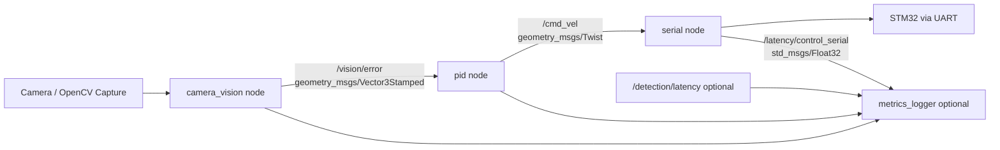

# Pan Tilt Controller (ROS 2)

Dokumentasi ini merangkum struktur sistem `pan_tilt_controller` secara ringkas dan siap dipakai untuk halaman GitHub repository.

## 1) Deskripsi Sistem

Sistem ini adalah pipeline kontrol pan-tilt berbasis ROS 2 untuk melakukan tracking manusia menggunakan model YOLO (`best.pt`, class `Human-body`) dari kamera lalu menggerakkan aktuator pan/tilt melalui serial.

Alur utama:
1. Node visi membaca frame kamera, menjalankan YOLO untuk target `Human-body`, lalu menghitung error posisi target terhadap pusat frame.
2. Node PID mengubah error posisi menjadi perintah kecepatan pan/tilt.
3. Node serial mengirim perintah tersebut ke mikrokontroler (mis. STM32/ESP32) via UART.
4. (Opsional) Node `metrics_logger` mencatat `/vision/error`, `/cmd_vel`, dan latency ke file CSV.

Tujuan kontrol: menjaga target tetap dekat titik tengah frame kamera.

## 2) Arsitektur Node

Node yang dijalankan dari launch file `launch/pan_tilt.launch.py`:

| Node Name (runtime) | Executable | Peran |
|---|---|---|
| `/camera_vision` | `camera_vision_node` | Deteksi manusia (YOLO), hitung error X/Y, tampilkan window debug OpenCV |
| `/pid` | `pid_node` | Hitung kontrol PID dari error visi menjadi `cmd_vel` |
| `/serial` | `serial_node` | Kirim `cmd_vel` ke perangkat melalui serial |
| `/metrics_logger` | `metrics_logger` | Logging CSV untuk `/vision/error`, `/cmd_vel`, dan latency (opsional) |

Catatan:
- Nama runtime di atas berasal dari `name=` pada launch file.
- Nama class pada source adalah `CameraVisionNode`, `PIDNode`, `SerialNode`, `MetricsLogger`.

## 3) Parameter List

### 3.1 `/camera_vision`

| Parameter | Tipe | Default (kode) | Default (launch) | Keterangan |
|---|---|---|---|---|
| `camera_id` | integer | `30` | `0` | Index kamera OpenCV |
| `frame_width` | integer | `640` | `640` | Lebar frame |
| `frame_height` | integer | `480` | `480` | Tinggi frame |
| `deadzone` | integer | `40` | `0` | Ambang error agar dianggap nol |
| `show_debug` | boolean | `false` | `true` | Tampilkan window debug OpenCV (bukan topic) |
| `flip_horizontal` | boolean | `true` | tidak di-set (pakai default) | Mirror frame horizontal |

Catatan: model YOLO `best.pt` dibaca dari folder paket, dan target class `Human-body` bersifat hardcoded.

### 3.2 `/pid`

| Parameter | Tipe | Default (kode) | Default (launch) | Keterangan |
|---|---|---|---|---|
| `Kp` | float | `0.5` | `7.0` | Gain proporsional |
| `Ki` | float | `0.01` | `0.8` | Gain integral |
| `Kd` | float | `0.1` | `1.5` | Gain derivatif |
| `max_vel` | integer/float | `2000` | `5000` | Batas saturasi output |
| `rate_limit` | integer/float | `200` | `1000` | Batas perubahan output per callback |
| `control_rate` | integer/float | `20` | `20` | Frekuensi loop kontrol (Hz) |

### 3.3 `/serial`

| Parameter | Tipe | Default (kode) | Default (launch) | Keterangan |
|---|---|---|---|---|
| `port` | string | `/dev/ttyACM0` | `/dev/ttyACM0` | Port serial perangkat |
| `baudrate` | integer | `115200` | `115200` | Kecepatan UART |

### 3.4 `/metrics_logger` (opsional)

| Parameter | Tipe | Default (kode) | Default (launch) | Keterangan |
|---|---|---|---|---|
| `test_id` | string | `run` | `dist1p5_bright` | ID sesi untuk nama file |
| `distance` | float | `0.0` | `1.5` | Jarak pengujian (meter) |
| `light_condition` | string | `unknown` | `bright` | Kondisi cahaya |
| `output_dir` | string | `~/metrics_logs` | `/home/akmal/Documents/finalproject/metrics_logs` | Folder output CSV |
| `queue_size` | integer | `10000` | tidak di-set (pakai default) | Ukuran antrean internal |
| `flush_interval_sec` | float | `0.5` | tidak di-set (pakai default) | Interval flush file |
| `latency_topic` | string | `/detection/latency` | `/latency/control_serial` | Topic latency (opsional) |
| `latency_msg_type` | string | "" | `std_msgs/msg/Float32` | Tipe pesan ROS untuk latency (jika kosong, tidak subscribe) |
| `latency_field` | string | `data` | tidak di-set (pakai default) | Nama field nilai latency |

## 4) Topic List

Topic utama sistem:

| Topic | Type | Publisher | Subscriber | Fungsi |
|---|---|---|---|---|
| `/vision/error` | `geometry_msgs/msg/Vector3Stamped` | `/camera_vision` | `/pid`, `/metrics_logger` | Error tracking (`vector.x=err_x`, `vector.y=err_y`, `vector.z=confidence`) + timestamp capture |
| `/cmd_vel` | `geometry_msgs/msg/Twist` | `/pid` | `/serial`, `/metrics_logger` | Perintah kecepatan pan/tilt |
| `/latency/control_serial` | `std_msgs/msg/Float32` | `/serial` | `/metrics_logger` | Latency error-receive -> serial write |
| `/detection/latency` (opsional) | (tergantung `latency_msg_type`) | Publisher eksternal | `/metrics_logger` | Latency eksternal lain (jika override parameter logger) |

Catatan: tampilan debug hanya berupa window OpenCV lokal.

Topic standar ROS 2 yang juga ada saat node aktif:
- `/parameter_events`
- `/rosout`

## 5) Type dan Interface

### 5.1 Interface yang dipakai runtime

#### `geometry_msgs/msg/Vector3Stamped`
Digunakan pada `/vision/error`.

```text
std_msgs/Header header
geometry_msgs/Vector3 vector
```

Pemaknaan di sistem ini:
- `header.stamp`: timestamp capture frame (untuk vision latency)
- `vector.x`: error horizontal (pixel)
- `vector.y`: error vertikal (pixel)
- `vector.z`: confidence deteksi YOLO (`0.0` jika tidak ada deteksi)
#### `std_msgs/msg/Float32`
Digunakan pada `/latency/control_serial`.

```text
float32 data
```

Pemaknaan di sistem ini:
- `data`: latency (ms) dari error diterima di serial node sampai serial write


#### `geometry_msgs/msg/Twist`
Digunakan pada `/cmd_vel`.

```text
geometry_msgs/Vector3 linear
geometry_msgs/Vector3 angular
```

Pemaknaan di sistem ini:
- `linear.x`: `pan_vel`
- `linear.y`: `tilt_vel`
- Field lain tidak digunakan.

#### Latency topic (opsional)
Tipe pesan latency ditentukan oleh parameter `latency_msg_type` (contoh: `std_msgs/msg/Float32`), dan nilai diambil dari field `latency_field` (default: `data`).

### 5.2 Interface custom dalam paket

File: `msg/ErrorMsg.msg`

```text
int32 err_x
int32 err_y
float32 confidence
```

Status: saat ini belum dipakai oleh node runtime (pipeline aktif memakai `geometry_msgs/msg/Vector3Stamped`).

## 6) Flow Data Sistem


```mermaid
flowchart LR
    CAM[Camera / OpenCV Capture] --> CV[camera_vision node]
    CV -->|/vision/error\ngeometry_msgs/Vector3Stamped| PID[pid node]
    PID -->|/cmd_vel\ngeometry_msgs/Twist| SER[serial node]
    SER --> MCU[STM32 via UART]
    CV --> LOG["metrics_logger optional"]
    PID --> LOG
    SER -->|/latency/control_serial\nstd_msgs/Float32| LOG
    LAT["/detection/latency optional"] --> LOG
```

Penjelasan alur:
1. `camera_vision` membaca frame, menjalankan YOLO `best.pt` untuk class `Human-body`, lalu menghitung error terhadap pusat frame.
2. Error dipublish ke `/vision/error` sebagai `Vector3Stamped` dengan `header.stamp` saat capture.
3. `pid` menerima error, melakukan pembalikan sumbu pan (`err_x` dibalik), kontrol PID + saturasi + rate limit, lalu publish `/cmd_vel`.
4. `serial` menerima `/cmd_vel` dan mengirim string perintah format `P{pan},T{tilt}\n` ke mikrokontroler.
5. (Opsional) `metrics_logger` mencatat `/vision/error`, `/cmd_vel`, dan latency ke CSV.

## 7) Interface ke Hardware (Serial)

Format command serial dari node:

```text
P+1000,T-500
```

Detail:
- Prefix `P` = pan velocity
- Prefix `T` = tilt velocity
- Nilai bertanda `+/-`
- Diakhiri newline `\n`

## 8) Daftar Dependency Paket

Dari `package.xml`, dependensi utama:
- `rclpy`
- `sensor_msgs`
- `geometry_msgs`
- `cv_bridge`
- `std_msgs`
- `python3-serial`
- `python3-opencv`
- `ros2launch` (exec depend)

Tambahan Python (pip) untuk node YOLO:
- `ultralytics`
- `numpy`

## 9) Menjalankan Sistem

```bash
cd ros2_ws
colcon build --packages-select pan_tilt_controller --symlink-install
source install/setup.bash
ros2 launch pan_tilt_controller pan_tilt.launch.py
```

Override logger dan window debug:

```bash
ros2 launch pan_tilt_controller pan_tilt.launch.py enable_logger:=false show_debug:=false
```

Pastikan file model `best.pt` tersedia di folder paket.

Cek cepat runtime:

```bash
ros2 node list
ros2 topic list
ros2 topic info /vision/error
ros2 interface show geometry_msgs/msg/Vector3Stamped
```

## 10) Catatan Implementasi Penting

- Node vision memakai model YOLO `best.pt` dengan class target `Human-body` (hardcoded).
- Node PID melakukan pembalikan arah pan (`err_x = -err_x_raw`) agar arah gerak sesuai mekanik.
- Ketika `confidence` = `0.0`, node PID mengirim `pan_vel`/`tilt_vel` = `0.0`.
- `show_debug` hanya membuka window OpenCV lokal; tidak ada topic image.
- Anti-windup sederhana diterapkan saat output menyentuh batas saturasi.
- Parameter pada launch override default parameter di kode.
- `deadzone` yang kecil membuat sistem lebih responsif tetapi bisa menambah jitter.
- `control_rate` menentukan periode timer PID (dt = 1 / control_rate).
- `metrics_logger` menulis CSV ke `output_dir` dan bisa merekam latency jika `latency_msg_type` diset.
- Vision latency dihitung dari `header.stamp` pada `/vision/error` ke waktu publish saat diterima logger.
- Control+serial latency dipublish oleh `serial` ke `/latency/control_serial` (ms).
