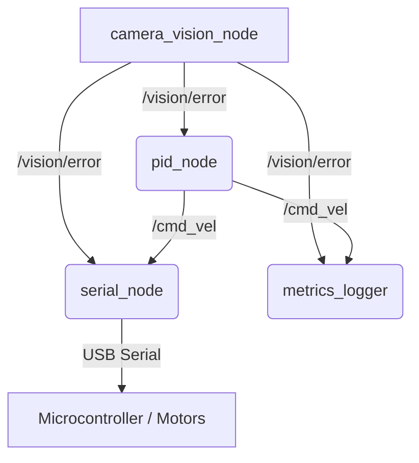

# Pan-Tilt Tracking System: Educational Documentation

Welcome to the comprehensive guide for our ROS2-based Pan-Tilt Tracking system. This document is designed for students and developers who want a deep understanding of how the system functions, right down to the data flow and the Python logic that evaluates its performance.

---

## 1. The ROS2 Pipeline Architecture

ROS2 (Robot Operating System 2) uses a **Publish/Subscribe** messaging architecture. Instead of programs calling each other directly, they broadcast (publish) messages to a "Topic" or listen (subscribe) to a "Topic". This decouples the components, making the system highly modular.

### Diagram: System Data Flow



### The Nodes (The Workers)

1. **`camera_vision_node` (The Eyes)**
   - **What it does:** Captures frames from a camera (e.g., webcam) and passes them into a YOLO neural network model.
   - **Target:** Looks specifically for the "Human-body" class.
   - **Output:** Calculates how far off the human is from the dead-center of the camera frame. This creates two errors: `err_x` (horizontal) and `err_y` (vertical).
   - **Publishes:** Sends a `Vector3Stamped` message to the `/vision/error` topic. (We pack `err_x` into the `x` field, `err_y` into `y`, and the YOLO `confidence` into `z`).

2. **`pid_node` (The Brain)**
   - **What it does:** Subscribes to `/vision/error`. Its job is to minimize those errors to zero using a Proportional-Integral-Derivative (PID) controller.
   - **Process:** It computes a compensating velocity based on the current error (Proportional), the accumulated past error (Integral), and the rate of change of the error (Derivative).
   - **Publishes:** Sends a `Twist` message to the `/cmd_vel` topic, dictating how fast the pan and tilt motors should move.

3. **`serial_node` (The Muscle Communicator)**
   - **What it does:** Subscribes to `/cmd_vel`. It translates the ROS2 twist commands into a string payload that the microcontroller (like an Arduino or STM32) can understand.
   - **Payload Format:** `P<pan_velocity>,T<tilt_velocity>\n` (e.g., `P+1000,T-500\n`).
   - it then pushes these bytes over the serial USB port.

4. **`metrics_logger` (The Black Box)**
   - **What it does:** Listens to everything (`/vision/error`, `/cmd_vel`, latencies) and safely records it as timeseries data into CSV files inside the `metrics_logs/` directory for later analysis.

---

## 2. In-Depth Script Analysis: `analyze_metrics.py`

Once a test run finishes, `metrics_logger` exposes a `.csv` file. To scientifically determine how well the tracking controller performed, we use `analyze_metrics.py`. 

This script relies heavily on **NumPy**, a powerful library for matrix multiplication and high-speed array calculations. Let's break it down section by section.

### A. Data Loading & Extraction

```python
def _load_rows(csv_path):
    with csv_path.open('r', newline='') as handle:
        reader = csv.DictReader(handle)
        rows = list(reader)
    return rows
```
* **Line-by-line understanding:** `csv.DictReader` attempts to read the top row of the CSV file to use as dictionary keys. Every subsequent row gets returned as a dictionary mapping `{column_name: value}`. 

```python
def _extract_series(rows):
    # ... arrays initialized ...
    for row in rows:
        if source == 'vision':
            t_values.append(_to_float(row.get('t_sec')))
            err_x_values.append(_to_float(row.get('err_x')))
    # ...
    return np.array(t_values), np.array(err_x_values) # etc
```
* **Concept:** ROS2 data isn't perfectly synchronous. Here, we iterate through the loaded rows, check if the data came from the vision system, extract string fields, convert them to floats using `_to_float()`, and combine them into `np.array` objects. Using NumPy arrays is critical because it allows us to do bulk math on the whole dataset at once.

### B. Control Theory Metrics

The script runs several mathematically distinct functions to rate system performance. 

#### 1. RMS Error (Root Mean Square)
```python
def _rms_error(t, err_x, err_y, steady_state_sec):
    mask = np.isfinite(t) & np.isfinite(err_x) & np.isfinite(err_y) & (t <= steady_state_sec)
    err_mag = np.sqrt(err_x[mask] ** 2 + err_y[mask] ** 2)
    return float(np.sqrt(np.mean(err_mag ** 2)))
```
* **What it is:** Measures the average absolute distance the target was away from the crosshair.
* **How it works:** 
    1. Generate a boolean `mask` to filter out broken `NaN` values and only look at data before a designated steady state cut-off. 
    2. `err_mag = np.sqrt(x^2 + y^2)` calculates the hypotenuse distance (Pythagorean theorem) of the target from the center.
    3. `np.mean(err_mag ** 2)` squares everything to penalize worse deviations, finds the average, and then squareroots it back.

#### 2. Loss of Lock
```python
def _loss_of_lock_per_minute(t, conf, threshold, min_duration):
    # Loop over all confidence values
    for idx, value in enumerate(conf):
        low = value < threshold
        # If we weren't in a low state, and now we are -> mark start time
        # If we were in a low state, and now we exceeded threshold -> event complete
```
* **What it is:** Calculates how often the neural network "lost" the subject per minute.
* **How it works:** It acts like a state machine using the `in_low` boolean. If confidence dips below a threshold (say, 50%) for longer than `min_duration`, it counts as 1 loss event.

#### 3. Settling Time
```python
def _settling_time(t, err_x, step_start, settle_band, hold_sec, final_window_sec, step_search_window_sec):
    # ... [Find the sudden step response] ...
    step_offset = int(np.argmax(diffs))
    
    # ... [Calculate when it stays stable] ...
    within = np.abs(err_x - final_value) <= settle_band
```
* **What it is:** Calculates the time it takes for the camera to snap to the subject and stop bouncing around.
* **How it works:** 
    1. It limits the arrays to look only at changes after a test step starts.
    2. Uses `np.argmax(diffs)` to find the massive spike in error (the moment the subject abruptly moves).
    3. Traverses forward in time checking `within` (is the error inside our acceptable `settle_band` limits?).
    4. If the error stays inside the limits for longer than `hold_sec`, the time difference is returned as the Settling Time.

#### 4. Peak Overshoot Percentage
```python
def _peak_overshoot_percent(t, err_x, step_start, final_window_sec):
    # ... code masking ...
    final_error = float(np.median(np.abs(err_x[final_mask])))
    peak_error = float(np.max(np.abs(err_x[after_step_mask])))
    return (peak_error - final_error) / final_error * 100.0
```
* **What it is:** Measures how aggressively the PID tuned the motors. Did the camera swing right past the subject before correcting back?
* **How it works:** 
    1. Checks the *median* error of the final few seconds (`final_error`) to find out where the camera "ultimately rested".
    2. Checks the *maximum* error encountered immediately after the subject moved (`peak_error`).
    3. Uses standard percentage change formula: `(Peak - Final) / Final * 100`.

### C. Script Execution (`main`)
At the bottom of the script:
```python
def main():
    parser = argparse.ArgumentParser(description='Analyze metrics CSV files.')
    # ...
    csv_files = sorted(args.folder.glob('*.csv'))
```
The script uses python's built-in `argparse` module, which takes terminal commands like `--steady-state-sec 60.0` and converts them into variables the script can use. Then `glob('*.csv')` fetches all logged files in the specified folder and processes them one by one.

---

## 3. False Positive Evaluator: `false_positive_rate.py`

While `analyze_metrics.py` parses `.csv` files containing tracking logs, you also have `false_positive_rate.py` which interacts directly with **ROS2 Bags**.

* **Why ROS Bags?** ROS Bags are binary databases (`sqlite3`) that record raw topic streams exactly as they happened. 
* **The Goal:** Used specifically for "Empty Room Testing". If the room is empty, any published `/vision/error` topic with a high confidence `z` value is a false positive (a "ghost" detection).
* **The Logic:**
  1. Opens the database natively using `from rosbag2_py import SequentialReader`.
  2. Parses out the specific topic (`/vision/error`).
  3. Deserializes the binary data directly back into the Python `Vector3Stamped` object.
  4. Increments a counter every time `confidence > threshold`. 
  5. Computes a `/minute` failure rate.

---
### Summary

By dividing this system across multiple **Nodes**, we separated vision AI, motor control math, and hardware communication into self-contained environments. By storing that real-time data asynchronously using the **logger node**, it allows powerful post-run processing scripts to scientifically evaluate system tracking latency, accuracy, and tuning variables immediately after tests finish.